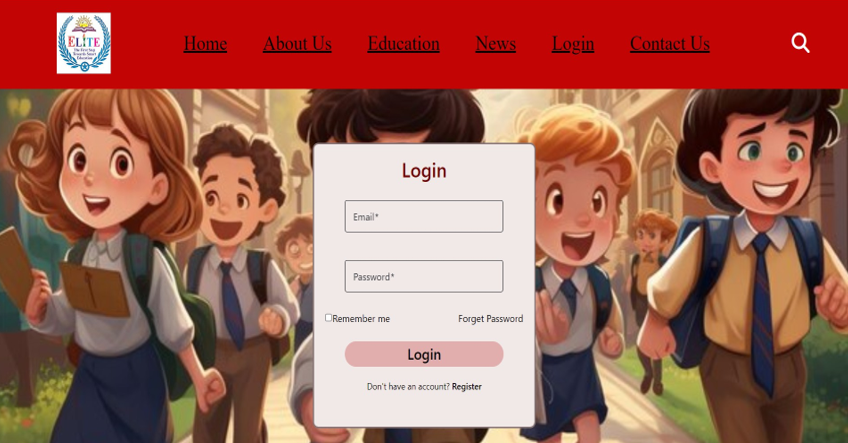
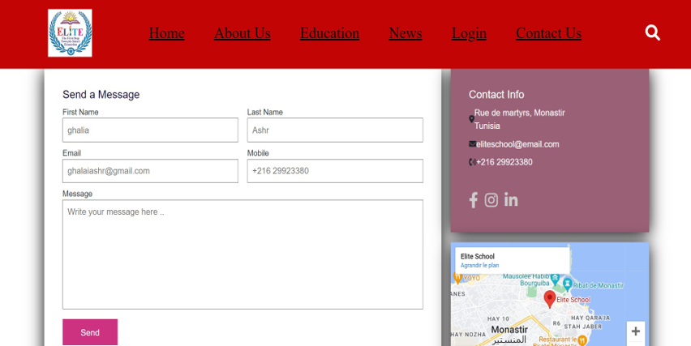
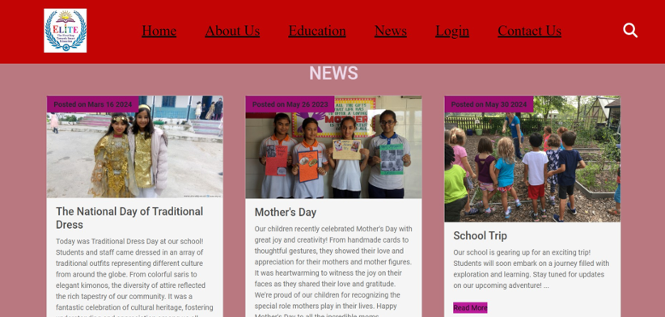
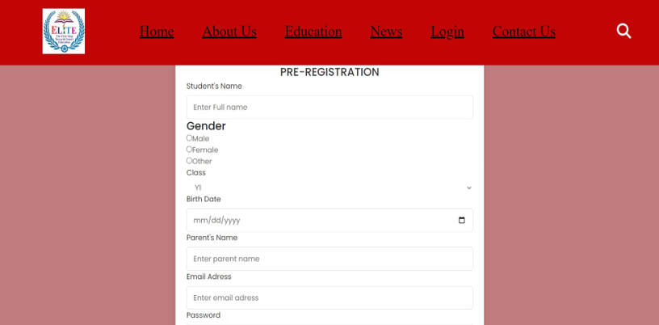
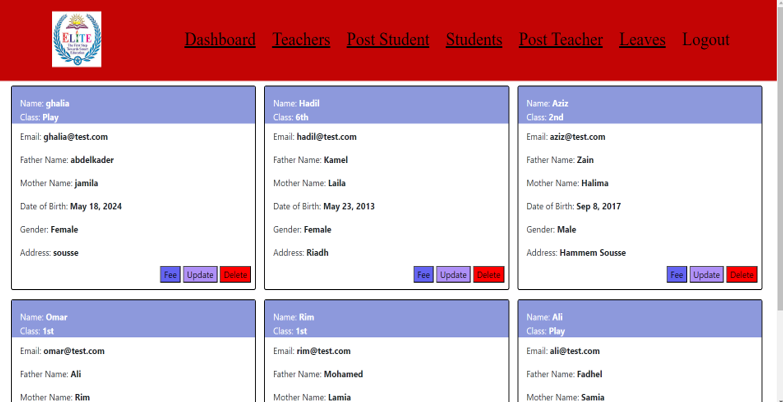
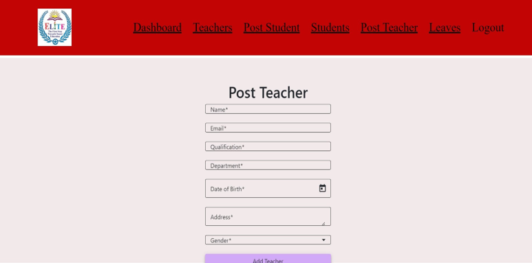
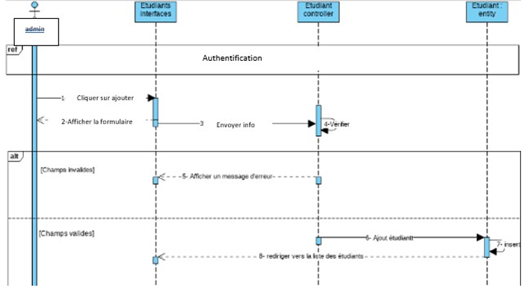
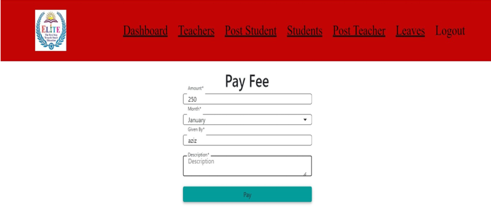

# 🎓 School Management System

A full-stack web application for managing a private school, built with **Angular** and **Spring Boot**.

---

## 📌 Project Overview

This system helps manage the daily operations of a private school, including:

- Students management
- Teachers management
- Classes and schedules
- Absences tracking
- Payments management
- School news and announcements

The project is designed using **UML modeling** and follows a structured software engineering approach.

---

## 👥 System Actors

- **Admin**
  - Manage users (students, teachers)
  - Manage events and news
  - Handle payments and messages

- **Student**
  - View courses and schedule
  - Check absences and grades
  - Access announcements

- **Teacher**
  - Manage courses
  - Evaluate students
  - Communicate with students and parents

- **Visitor**
  - View school information
  - Pre-register students
  - Contact administration

---

## 🧠 UML Design

The system was designed using UML diagrams:

- Use Case Diagrams
- Sequence Diagrams
- Class Diagram

---

## 🛠️ Tech Stack

### Frontend
- Angular
- TypeScript
- HTML / CSS

### Backend
- Spring Boot
- Java
- REST API

### Database
- MySQL

### Tools
- Postman (API testing)
- GitHub (version control)

---
## 📁 Project Structure

frontend/ → Angular application
backend/ → Spring Boot API
docs/ → Screenshots & UML diagrams
---

## 🚀 Features

- Authentication system (login/register)
- Student management (CRUD)
- Teacher management
- Absence management
- Payment tracking
- News & announcements
- Pre-registration system

---

## ▶️ How to Run the Project

### Backend

```bash
cd backend
mvn spring-boot:run

Backend runs at:

http://localhost:8080


### Frontend
cd frontend
npm install
ng serve

Frontend runs at:


http://localhost:4200

📸 Screenshots










